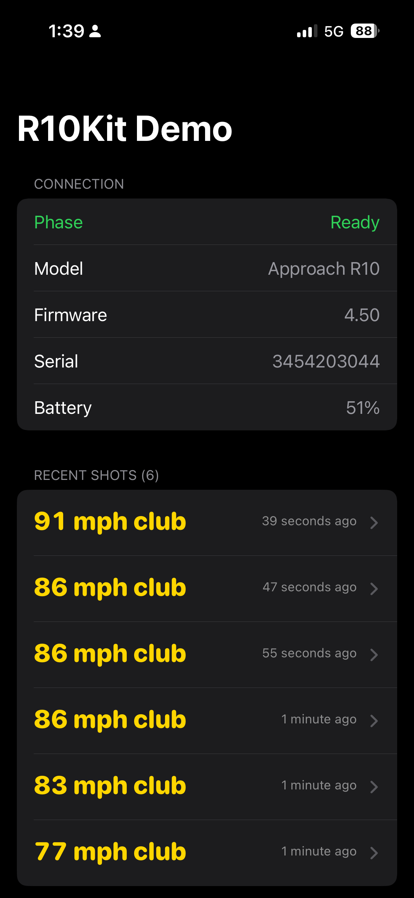
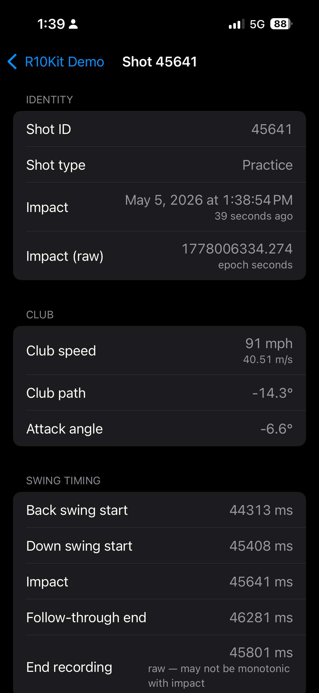
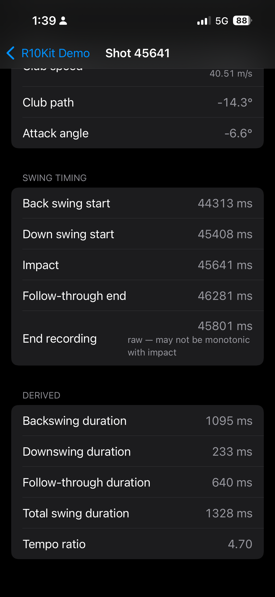

# R10Kit — Unofficial R10 iOS SDK

A native Swift SDK for connecting to the R10 launch monitor over
Bluetooth Low Energy. Pure Swift, no first-party app required.

> **Disclaimer.** This is an unofficial SDK. The
> protocol layer is reverse-engineered from publicly available work
> ([mholow/gsp-r10-adapter](https://github.com/mholow/gsp-r10-adapter)).

## Screenshots

The bundled demo app shows every field the SDK exposes — tap any shot to drill into its full data:

| Connection + recent shots | Shot detail (no-ball practice) | Derived metrics + tempo |
|:---:|:---:|:---:|
|  |  |  |

The middle screenshot is a no-ball practice swing — `Ball` section is absent because the radar has nothing to measure, but `Club` (speed, path, attack angle) and `Swing timing` still populate. That's the SDK's signature feature.

## Features

- Direct BLE connection to the R10. No first-party app, no PC tether.
- Full proto parsing for every shot the device emits: club speed,
  ball speed, launch angle/direction, spin rate + axis + provenance,
  attack angle, club face/path, swing-timing milliseconds, shot type
  (practice / normal), tilt-at-impact.
- No-ball practice swings — the R10 emits metrics on a
  full swing without a ball; this SDK exposes them.
- Connection state stream with auto-reconnect to the most recently
  paired R10.
- AsyncStream-first API. Modern Swift Concurrency, no delegates.
- iOS 17+ / watchOS 10+ / macOS 14+. Pure Swift Package.
- 58 unit tests covering framing, COBS, CRC, proto parsing,
  time-base conversion, and the swing-rejection detector.

## Quickstart

### 1. Add R10Kit to your project

In Xcode:

1. File → Add Package Dependencies…
2. Paste this repo's URL.
3. Select R10Kit and add it to your app target.

Or via `Package.swift`:

```swift
dependencies: [
    .package(url: "https://github.com/HectorZarate/unofficial-r10-ios-sdk", from: "0.1.0"),
],
targets: [
    .target(
        name: "MyApp",
        dependencies: [
            .product(name: "R10Kit", package: "unofficial-r10-ios-sdk"),
        ]
    )
]
```

### 2. Add the Bluetooth permission string to Info.plist

```xml
<key>NSBluetoothAlwaysUsageDescription</key>
<string>R10Kit needs Bluetooth to connect to your R10.</string>
```

### 3. Connect and read shots

```swift
import R10Kit

let connection = R10Connection()
let device = R10Device(connection: connection)

// Phase pipe — the app forwards transport phases to the device
// because AsyncStream is single-consumer.
Task {
    for await phase in connection.phases {
        print("R10 phase: \(phase)")
        await device.notifyPhaseChange(phase)
    }
}

// Shot stream.
Task {
    for await shot in device.shotEvents {
        if let mps = shot.metrics.clubMetrics?.clubHeadSpeed {
            let mph = Double(mps) * mpsToMph
            print("Club speed: \(Int(mph.rounded())) mph")
        }
        if let ball = shot.metrics.ballMetrics?.ballSpeed {
            print("Ball speed: \(ball) m/s")
        }
    }
}

await device.start()
await connection.start()
```

### 4. Run the demo app

A runnable iOS demo lives at the repo root
(`Unofficial R10 iOS SDK.xcodeproj`). The local `R10Kit` package is
already wired into the demo target, so no manual "Add Package…"
step is needed.

1. Clone the repo and open `Unofficial R10 iOS SDK.xcodeproj` in Xcode.
2. Build and run on a physical iPhone. Bluetooth doesn't work in
   the simulator.

The demo shows connection state, model / firmware / battery, and a
list of recent shots.

## Public API at a glance

```swift
public actor R10Connection {
    public init()
    public func start()
    public func shutdown()
    public func forgetDevice()

    public nonisolated let phases: AsyncStream<R10Phase>
    public nonisolated let inboundPayloads: AsyncStream<Data>
    public nonisolated let batteryUpdates: AsyncStream<Int>
    public nonisolated let deviceInfoUpdates: AsyncStream<R10DeviceInfo>
    public nonisolated let frameTimestamps: AsyncStream<Date>

    public nonisolated static var hasStoredDevice: Bool { get }
}

public actor R10Device {
    public init(connection: R10Connection)
    public func start()
    public func notifyPhaseChange(_ phase: R10Phase) async
    public func stop()

    public nonisolated let shotEvents: AsyncStream<R10ShotEvent>
    public nonisolated let errors: AsyncStream<R10ErrorInfo>
    public nonisolated let tiltCalibrationUpdates: AsyncStream<R10CalibrationStatusType>
    public nonisolated let rejectedSwings: AsyncStream<Date>
}

public struct R10ShotEvent: Sendable {
    public let metrics: R10Metrics
    public let wallClockImpactAt: Date
}

public struct R10Metrics: Sendable {
    public var shotId: UInt32?
    public var shotType: R10ShotType?
    public var ballMetrics: R10BallMetrics?
    public var clubMetrics: R10ClubMetrics?
    public var swingMetrics: R10SwingMetrics?
}
```

Every parsed proto field — including the provenance enums
(`R10SpinCalcType`, `R10GolfBallType`) — is exposed publicly.
Source: `Sources/R10Kit/Protocol/R10Proto/R10Messages.swift`.

## Hardware tested

- iPhone 16 Pro, iOS 18.4
- R10, firmware 4.50

Real-byte regression fixtures from the device are committed under
`Tests/R10KitTests/Fixtures/`. They pin the parser against known
real-world R10 emissions so future SDK changes can't silently break
protocol compatibility.

## Contributing

See [CONTRIBUTING.md](CONTRIBUTING.md).

## Acknowledgements

This SDK builds on
[mholow/gsp-r10-adapter](https://github.com/mholow/gsp-r10-adapter) —
C# Windows-side reverse engineering of the R10's proprietary BLE
service. The protocol-level types here mirror that work, under the
same MIT license.

## License

[MIT](LICENSE).
